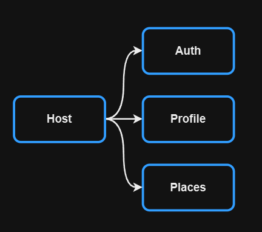

## Задание 1

Проведя анализ проекта монолитного фронтенда Mesto и изучив его фукционал, я выделил следующие независимые микрофронтенды:  
* Host - основное приложение в которое интегрируются остальные микрофронтенды
* Auth - регистрация новых и аутентификация существующих пользователей
* Profile - управление профилем пользователя (редактирование данных, смена аватара) 
* Places - управление фотографиями (загрузка, отображение, удаление, учет лайков)

Схема:

В качестве фреймворка для реализации микрофронтендов был выбран Module Federation, потому что:
* обеспечивает независимость разработки и развертывания микрофронтендов
* поддерживает ленивую загрузку модулей, сокращая начальную загрузку
* оптимизирует работу с зависимостями и ресурсами
* у меня есть небольшой опыт работы с ним (практическая работа для спринта)

## Задание 2

[Разбиение монолита](./MonolithDecomposition.drawio)